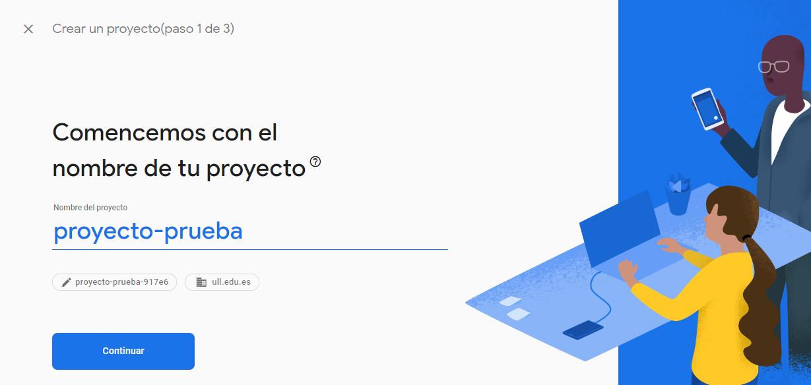
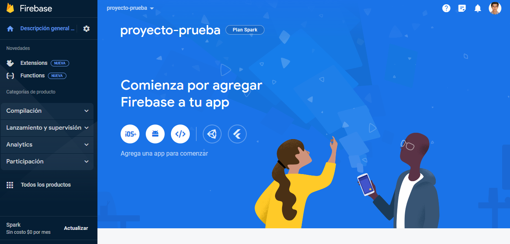
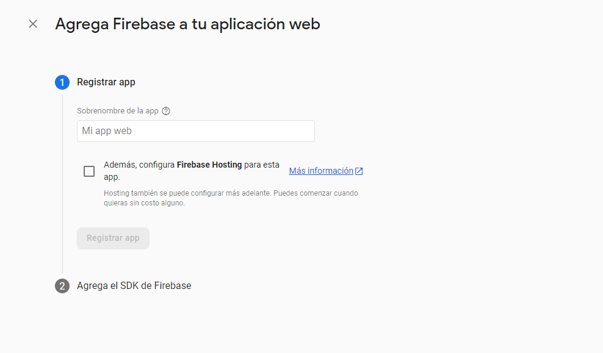
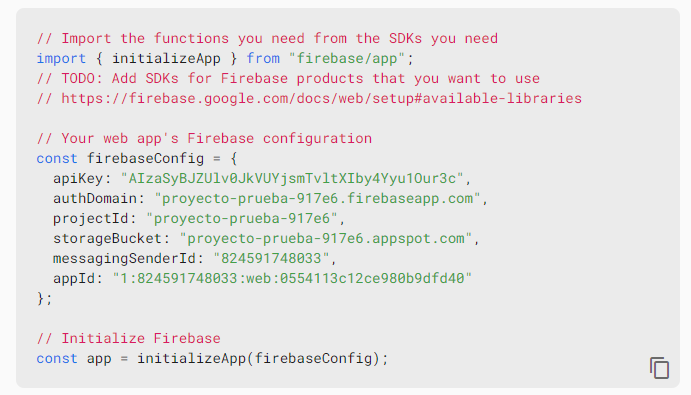
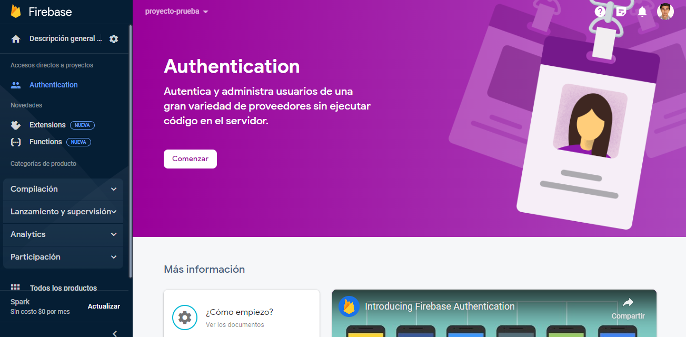
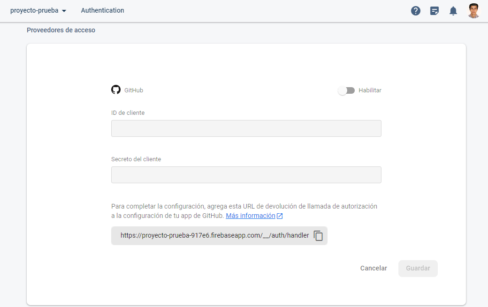
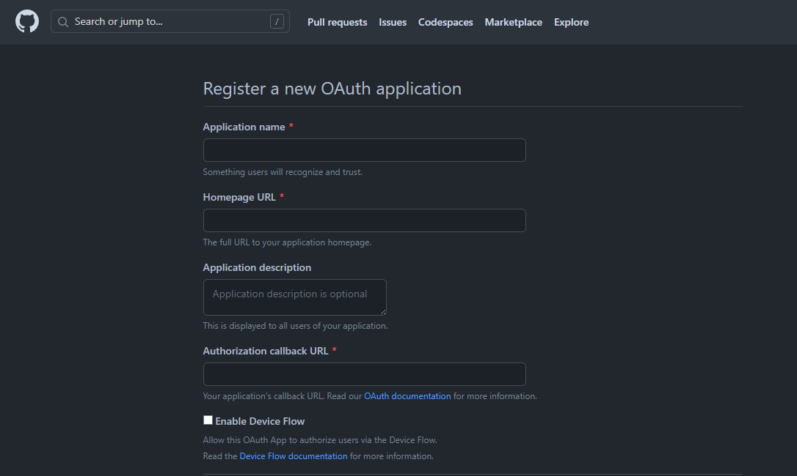
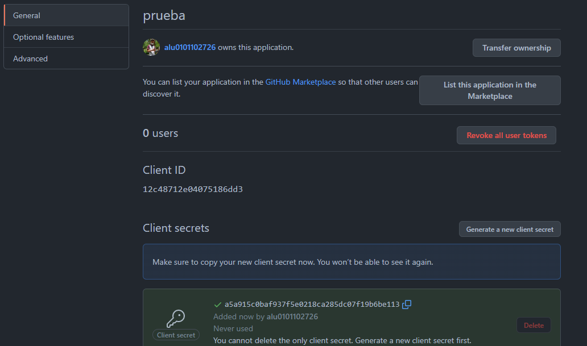

# Quick Guide

This is a quick guide for all the features of the template, were are the important files to change and all the important information.

## Tutorial

The first way is to download the code from the [GitHub Repository](https://github.com/gh-cli-for-education/gh-education). Once the code is downloaded in the environment the next step is to create the Firebase project needed to link with the system. 

### Firebase project
In order to create the first project, lets go to the [Firebase console](https://console.firebase.google.com/?hl=es-419) web where, when the user is logged in, then will be able to create a project. The first step is to add a name to the project (that will be identified with an ID) and set the domain that project will be lined with. Then, for this case, there is no need to toggle on the analytic option (it's used to track user activity inside the application). Finally, the project will be created in a few minutes.



Once the project is create and the user press the ready button, the page will be redirected to the homepage of that project. First of all, let's add an app to link with the one that is developed in the template. To do this, in the homepage, there are 5 icons. Each of them refers to a type of application. In this case the application developed is web so we need to click in the icon *<\\>*.



Now it's time to add the first information about our system. The app need a name to be registered and only accept names that hasn't been used in other projects. 



Once the application is created, then the Firebase SDK configuration will be showed. This information is important because it will be the credentials for the system to link with this application. So, once we have them, we will copy the _firebaseConfig_ and replace it in _<YOUR-PATH>/vite-education/docs/.vitepress/firebase.js_ with the content generated. This code also will be available in the configuration of the project so it won't be lost.



Now the project is linked with the app, the next step is to select what type of authentication will be available for the user. To choose this, let's go to All the products section (in the project home page) and select Authentication. When it is selected, when we hit the begin button all the available sign in methods will be displayed.



### GitHub authentication

Then, as we talked in the other chapters, the authentication in the system is through GitHub. This is because, getting the token of the user in GitHub makes easier to do some queries to get organization information. Then, when we select that provider, it asks to link with GitHub using an ID and a secret.



To obtain this two elements let's move to our [GitHub account](https://github.com). First we will go to settings, then in the side navigation var, in the integration section, we will click in applications. Here, there are 3 types of applications, but the one that we are going to work with are the *Authorized OAuth Apps*. To create an application let's move to the Authorized OAuth Apps and click new or follow this [link](https://github.com/settings/applications/new). Then, fill all the information (the home page depends on which host you are going to use, can be Firebase too) and in the last field, there will be copied the callback URL that Firebase displayed.



When the application is created, now the owner can copy the ID, paste it in the Firebase GitHub provider form and then generate the secret token (will be showed only once so copy it and then paste in the other side). Now with all this information filled, now the application is ready to be used.



### Create environment
With all the Firebase configuration done, the next thing to do is set the environment and install all the packages. To do this, it can be followed the guide showed in the [GitHub template](https://github.com/gh-cli-for-education/gh-education). There are only 3 steps to run the application:

1. Install the dependencies: The dependencies manager used in this project is npm, so to install all the dependencies only need to do _npm install_.
2. Run the project: The project can be tried in different modes. In order to set all the information while seing the changes the best is the developer mode ran usign _npm run docs:dev_. It is also available to build it using _npm run docs:build_ or serve the changes to see how the build went using _npm run docs:serve_.
3. When all the changes are ready, there is a script called _deploy.sh_ that allow to deploy the project to GitHub pages in a repository.   

## How to use 

- Fist clone the project and enter into the _vite-education_ folder, then install the dependencies doing:
```
npm i
```

- After lunch the server mode of vitepress doing:
```
npm run docs:dev
```

- Finally run deploy.sh to deploy the result in GitHub pages:
```
./deploy.sh
```


## Auth

First of all there is an authentication system using firebase cloud hosting. This allow the teacher to have his own free databaste for the students (all of this is configured automatically in the script).

First the user need to login or register into the system. All the users are registrated into the firebase project.

<Auth></Auth>

## Tabs

In the navbar there are diferent pages for the units, teams, students, schedule,...

[🕒 Schedule ](./vite-education/docs/schedule.md)
[🧑🏽‍🏫 Lessons ](./vite-education/docs/lessons/lessons.md)
[💻 Tasks ](./vite-education/docs/tasks/tasks.md)
[👥 Teams ](./vite-education/docs/teams/teams.md)
[📝 Units ](./vite-education/docs/units/units.md)

## Teams & Students

This is a tab related with Github. In this page, we can have all the students of our github organization, also the teams of it. For each team we can know basic information about it like repositories, profile github pages, etc. If we want we can know more information about the student like the recent organization posts.

[👥 Teams ](./vite-education/docs/teams/teams.md)

## Configuration

As this is a template, it can be changed the way the user want. All the vitepress configuration is in the folder _.vitepress_, and there we can have the diferent vue components (folder _components_), css for some html elements, public folder that have information like teams, units that are published,... and the vitepress and firebase intial config.

```
docs/.vitepress/
├── deploy.sh
├── docs
│   ├── auth.md
│   ├── guide.md
│   ├── index.md
│   ├── lessons
│   │   ├── 1º Week
│   │   │   ├── 13-10-22-leccion.md
│   │   │   └── 15-10-22-leccion.md
│   │   ├── 2º Week
│   │   │   └── 18-10-22-leccion.md
│   │   └── lessons.md
│   ├── public
│   │   └── assets
│   │       ├── logo-gh-dark.png
│   │       └── logo-gh-light.png
│   ├── schedule.md
│   ├── tasks
│   │   ├── iaas.md
│   │   └── tasks.md
│   ├── teams
│   │   └── teams.md
│   └── units
│       ├── 1º Unit
│       │   ├── 1º section
│       │   │   └── Async JS.md
│       │   └── presentation.md
│       └── units.md
├── package-lock.json
├── package.json
├── src
│   └── update-units.js
└── webpack.config.js
```

